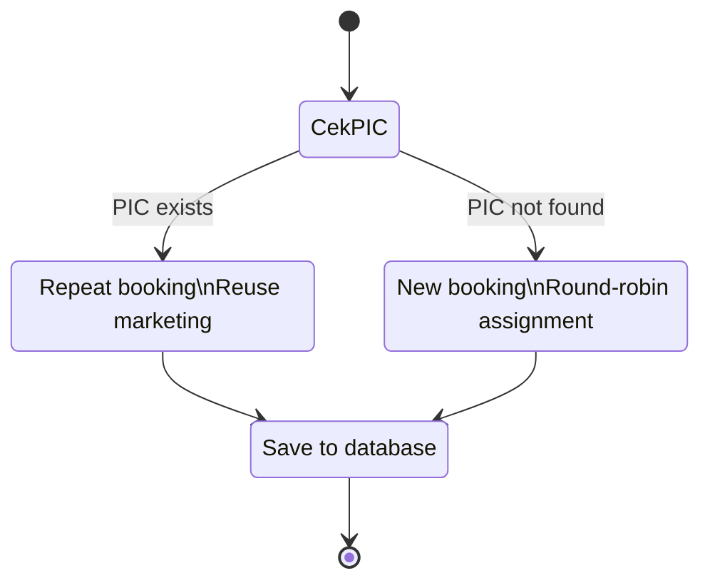

# 🚀 Booking Assignment System


A lightweight booking assignment system that automatically assigns marketing ownership using repeat detection and round-robin distribution.

---

## 📸 Screenshot


> Replace with actual UI screenshot

---

## 🧠 Overview

This system automates booking assignment by checking whether a PIC already exists.

- Existing PIC → repeat booking
- New PIC → round-robin marketing assignment

Designed to ensure fair distribution and customer continuity.

---

## 🏗 Architecture



Architecture style: **MVC + Service Layer**

- Controller → request handling
- Service → business logic
- Model/Repository → database access

---

## ⚙️ Tech Stack

- PHP 8
- MySQL
- JavaScript
- HTML/CSS
- MVC Architecture
- Mermaid (documentation diagrams)

---

## 📂 Project Structure

```
project-root/
│
├── app/
│   ├── controllers/
│   ├── services/
│   ├── models/
│   └── views/
│
├── public/
│   └── assets/
│
├── docs/
│   ├── architecture/
│   └── screenshots/
│
├── config/
├── README.md
└── LICENSE
```

---

## 🎯 Features

- Automatic marketing assignment
- Repeat client detection
- Round-robin distribution
- Audit-friendly workflow
- Clean architecture
- Documentation-ready repo

---

## 🧪 Future Improvements

- REST API layer
- Role management
- Booking analytics dashboard
- Notification system
- Queue-based assignment

---

## 📄 License

This project is licensed under the MIT License.
